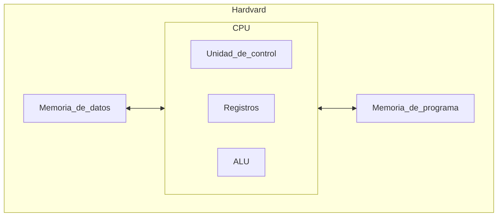
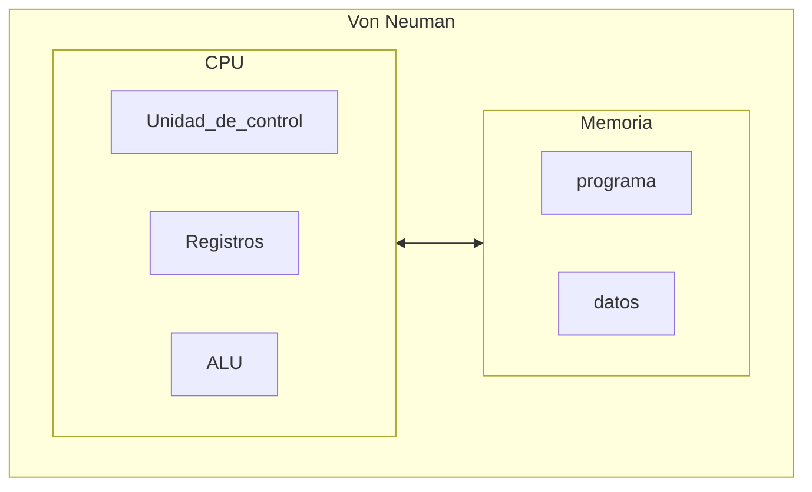
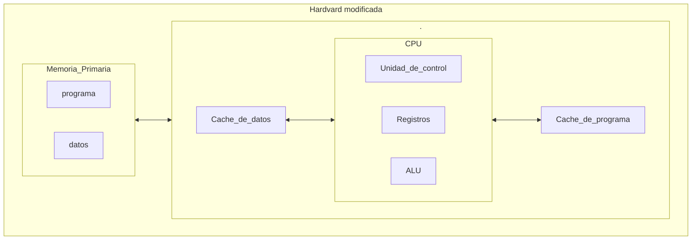

# Las arquitecturas

Explicaremos alguna de las arquitecturas mas comunes actualmente:

----
### - Arquitectura hardvard:
Lo podemos encontrar en sistemas embebidos como Arduino.

Esta arquitectura nos permite trabajar en paralelo, es decir, la `CPU` puede cargar la siguiente instrucción a ejecutar del programa mientras a la vez, puede leer o escribir datos que se vayan o se hayan usado en el programa. 

----
### - Arquitectura Von Neuman:

Esta arquitectura tiene una única memoria donde se almacena las instrucciones del código a ejecutar, y los datos. Siendo una separación lógica y no física. Este arquitectura pose cuello de botella entre la comunicación de la memoria con la `CPU`. Esta arquitectura no permite el paralelismo que nos otorgaba la arquitectura Harvard, por lo tanto, solo podremos leer o escribir un dato del programa, no podremos realizar ambos al mismo tiempo.
### - Arquitectura Harvard modificada:
Los procesadores `Intel` o `AMD` actuales, usan esta arquitectura.
Los procesadores actuales cuentan con memorias cache donde almacenan datos e instrucciones. Si no encuentras los datos en los registros, buscara en el cache de datos o de programa `L1`, si no esta ahí busca en `L2` y así de forma continua con cada memoria cache. Aunque la única memoria que esta divida en dos es `L1`, formando dos memorias. Todas las demás se encuentran juntas en una única memoria. Si el dato no existe en los registros o en las cache, será cuando vayan a pedir los datos a la memoria mediante el controlador de `E/S`

----

----
Actualmente los procesadores de `AMD` y `intel` tiene el mismo conjunto de instrucciones (`8086`). Esto se debe a que la empresa que creo este conjunto fue Intel, y las demás crearon procesadores clónicos que hacían uso del mismo conjunto. Es por esto, que es independiente la marca o fabricante del producto, pues estarán usando este mismo conjunto. Esto se hizo así para que el software desarrollado para procesadores `intel` fuera compatibles con los procesadores de los demás fabricantes. Adoptando el mismo conjunto de instrucciones para tu procesador, esto permite usar el software que se haya diseñado con dicho conjunto de instrucciones. No existe mucha diferencia entre un procesador actual, y los procesadores de los años 80 de Intel (`8086`) Lo único que a cambiado y mejorado, es el tamaño de los registros, la eficiencia energética, el numero de núcleos y etc. Pero en su base, siguen siendo el mismo.

----
### Nuestra CPU (Unidad Central de Procesamiento):
Se compone por:

1. `(ALU) Unidad Aritmetica Logica`: [ALU](./unidad-aritmetica-logica.md), es un circuito que permite realizar operaciones aritméticas básicas como sumar y restar. También permite realizar operaciones lógicas a nivel de bits, conocidas también como operaciones [[bitwise-basicos|Bitwise]]. Estas operaciones en su base son, `not`, `and`, `or`, `xor` y etc. Actualmente los procesadores cuentan con una ALU compleja y potente, de hecho, hay procesadores que tienen una ALU por núcleo.
   
2. `(UC) Unidad de control`: Su tarea es buscar las instrucciones a ejecutar en la memoria, interpretarlas y ejecutarlas ayudándose de la Unidad de Proceso. 
   
3. `Unidad de Proceso`: Esta unidad tiene como fin llevar a cabo las tareas que le encomienda la unidad de control. La unidad de proceso cuenta a su vez con una ([[FPU]])`unidad de coma flotante` para realizar operaciones con números reales de forma eficiente. Cuenta con un `registro acumulador` que guarda operandos y resultados de las operaciones. Tiene un `registro de estado` donde se guarda algunas informaciones de las operaciones que se a realizado, como si el valor es cero, o negativo entre otras. Y esta unidad cuenta con la [[ALU]].
   
4. `Registros`: Los [registros](./registros-cpu.md) de la CPU son memorias pequeñas y de rápido acceso. Como los registros generales, el registro acumulador, el registro de estado entre otros y etc.
    ^482839
5. `MP`: También llamado como Memoria primaria, memoria principal, memoria interna o memoria central, es aquella en la que se almacenan los datos y las intrusiones a ejecutar en el caso de las arquitecturas Harvard modificada. La `MP` se comunica con la `CPU` mediante `buses de datos` y el `bus de direcciones`.