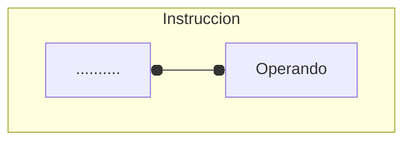
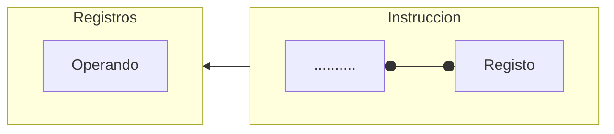
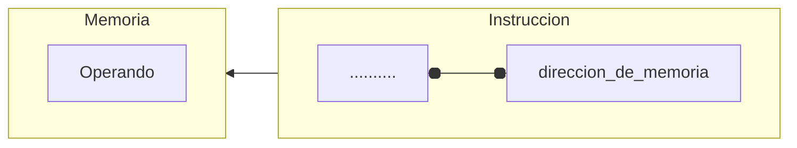
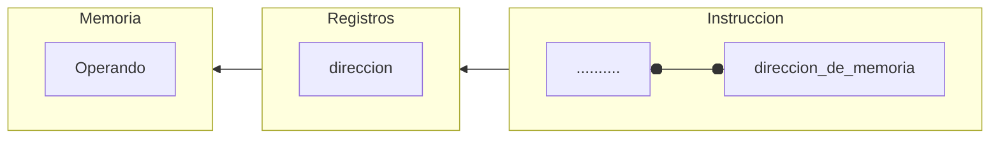
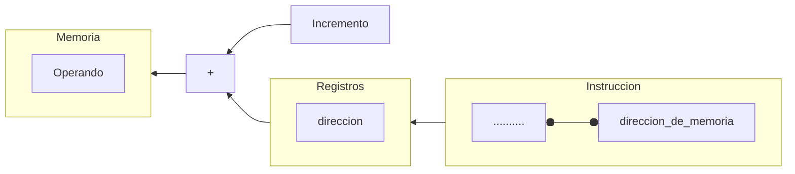
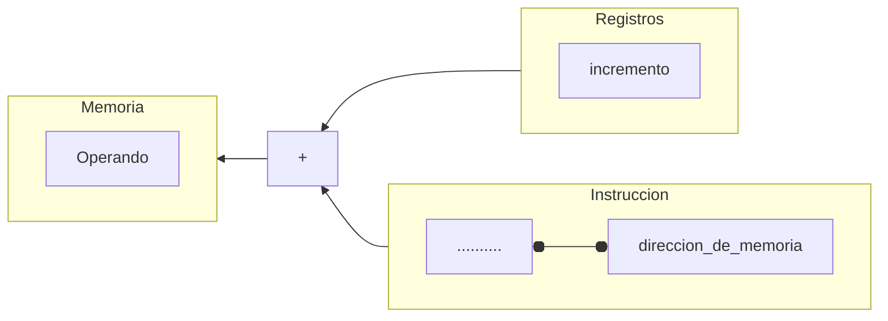
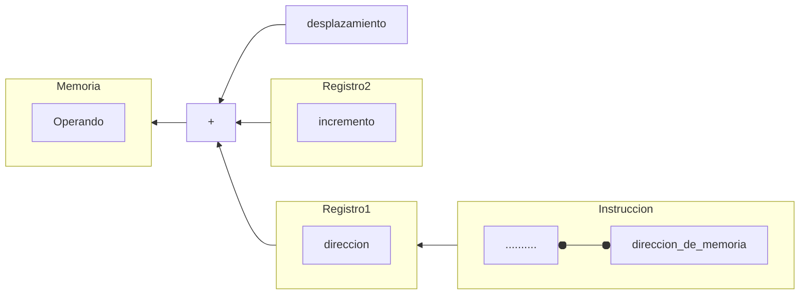

Estos serán los distintos modos que encontraremos en la arquitectura `x86`.

----
### Direccionamiento inmediato:

En este, tendremos un `operando destino`(lugar donde se almacenara el resultado de la operación) y tendremos un `valor inmediato`, que puede ser por ejemplo un numero como `3`.

----
### Direccionamiento por registro:
En este, las operaciones se llevan a cabo mediante registros, por ejemplo, sumar el registro `eax` con el registro `ebx` lo cual seria `add eax, ebx`, y el resultado se guardaría en `eax`. Previamente en `ebx` y `eax` se a almacenado valores que pudieron ser `valores inmediantos`.

----
### Direccionamiento directo:
En este, dentro de la instruccion se esta colocando una `dirrecion de memoria`, donde se encuentra un valor. Por ejemplo, pordemos decir suma el valor del registro `eax` con la `direccion de memoria` `0xfabc`, en este caso, se ira a dicha `direccion de memoria`, se obtendra el valor de ahi, y ese valor se sumara al registro `eax` y se guardara en el mismo.

----
### Direccionamiento indirecto a registro:
En este caso, podemos poner de ejemplo que `ebx` tiene una direccion de memoria, y que queremos sumar `ebx` con `eax`, Para esto, al hacer la suma, cuando el procesador va abuscar el valor `ebx`, se da "cuenta" de que este no es un `valor directo`, sino una `direccion de memoria`, por lo que la `CPU`, accedera a la memoria y buscara en esa direccion el valor que haya.

----
### Direccionamiento directo:
En este, dentro de la instruccion se esta colocando una `dirrecion de memoria`, donde se encuentra un valor. Por ejemplo, pordemos decir suma el valor del registro `eax` con la `direccion de memoria` `0xfabc`, en este caso, se ira a dicha `direccion de memoria`, se obtendra el valor de ahi, y ese valor se sumara al registro `eax` y se guardara en el mismo.


----

### Direccionamiento relativo a la base:
En estos casos, tenemos en un registro una `direccion de memoria` y la usamos como base, para con un incremento de `dirrecion de memoria`.

Como ejemplo podemos tener restar a `eax`, `ebx+2`, teniendo en `ebx` una `direccion de memoria`. Aquí lo que ocurría es que la `CPU` ira a buscar el valor en `ebx` y vera que es una `direccion de memoria`, que puede ser por ejemplo `0x0002`, y lo que ocurría a continuación, es que cojera esta valor, que es una `dirrecion de memoria` y le va a sumar `2`, esto es por que hemos dicho `ebx+2`.
Entonces si ``ebx`` tiene dicha dirección de memoria, podemos sumarles dos simplemente, quedando esta en `0x0004`, por lo que, el valor valor que se usara para hacer la operación
`eax = eax - [ebx+2]`, 
será el que se aloje en esta dirección, la `0x0004`, que pongamos de ejemplo que es 12 en decimal, por tanto, esto quedaría así después de que el procesador buscara en la memoria el `[ebx+2]` -> `eax = eax - 12`, y si ``eax``, vale 22 en decimal, `eax` valdrá `10` en decimal que es lo mismo que `0xa` en hexadecimal.


----
### Direccionamiento Indexado:

En estos casos, en la instrucción tendremos una dirección de memoria, y en el otro tendremos un valor con el que se hará de incremento, este incremento lo tendremos en un registro.

Un ejemplo seria:
suma el valor de la dirección de memoria `[ebx+0x0020]` con `ecx`. Aquí el registro `ebx`, tiene un valor de incremento y `ecx` puede contener un valor inmediato. Esto se usa para crear arrays por ejemplo.
```C
unsigned short array[3] = {2, 4, 6};
// un array con valores de 16bits=2Bytes.
// este array tiene 3 elementos asi que
// ocupa una cantidad de 2Bytes * 3elementos = 6Bytes.
```
Pongamos de ejemplo que tenemos este array, cada elemento que tiene dentro puede ocupar hasta ``2Bytes`` debido a que es un array de tipo `unsigned short`, si tenemos 3 elementos la cuenta es 2 por 3 que es `6Bytes`. Si el puntero de nuestro array(la dirección de memoria), es por ejemplo `0x0001`, necesitamos ir a la dirección `0x0003` si queremos ir al valor `4`, y a la dirección `0x0005` si queremos acceder al valor `6`, esto se debe a que son valores de `2Bytes`, Así que a la dirección de memoria base que es `0x0001`, le iremos incrementando en valor de `2`. En este caso, en la dirección de memoria base, se sitúa nuestro valor `2` del array. 
Esto en nuestro direccionamiento Indexado seria, [`ebx`+`0x0001`], siendo ``ebx`` ``2``, y esto nos daria el valor `4`.

----
### Direccionamiento indexado a la base
Este es una mezcla de todos los anteriores.



----