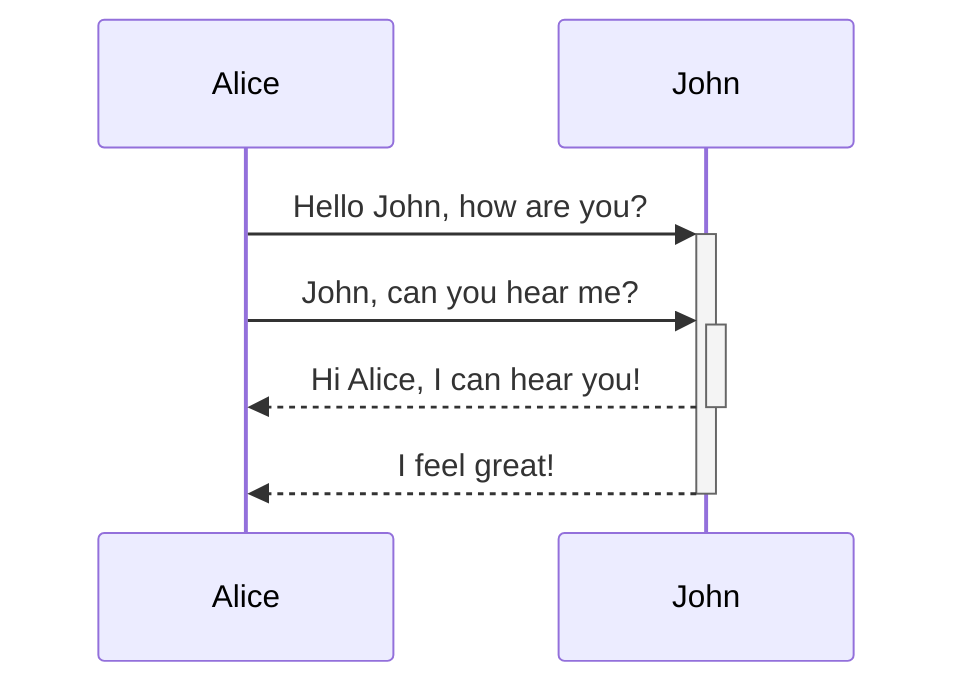
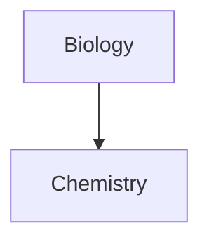

## Tablas

Puede crear una tabla usando barras verticales (`|`) y guiones (`-`). Las barras verticales separan las columnas y los guiones definen el encabezado de la columna.

```md
| Nombre | Apellido |
| ---------- | --------- |
| Máximo | Plank |
| María | curie |
```

|Nombre|Apellido|
|---|---|
|Max|Planck|
|María|Curie|

Las barras verticales a ambos lados de la mesa son opcionales.

No es necesario que las celdas estén perfectamente alineadas con las columnas. Cada fila de encabezado debe tener al menos dos guiones.

```md
Nombre | Apellido
-- | --
Máximo | Planck
María | Curie
```

### Dar formato al contenido dentro de una tabla

Puede utilizar [sintaxis de formato básico](https://help.obsidian.md/Editing+and+formatting/Basic+formatting+syntax) para aplicar estilo al contenido dentro de una tabla.

| Primera columna                                                                     | Segunda columna                                                                                                    |
| ----------------------------------------------------------------------------------- | ------------------------------------------------------------------------------------------------------------------ |
| [Enlaces internos](https://help.obsidian.md/Linking+notes+and+files/Internal+links) | Enlace a un archivo _dentro_ de su **bóveda**.                                                                     |
| [Incrustar archivos](https://help.obsidian.md/Linking+notes+and+files/Embed+files)  |  |
to [resize an image](https://help.obsidian.md/Editing+and+formatting/Basic+formatting+syntax#External%20images) in
> [!Barras verticales en mesas]
> 
> Si desea utilizar [alias](https://help.obsidian.md/Linking+notes+and+files/Aliases), o [cambiar el tamaño de una imagen](https://help.obsidian.md/Editing+and+formatting/Basic+formatting+syntax#External%20images) en su tabla, debe agregar un `\` antes de la barra vertical.
> 
> ```md
> Primera columna | Segunda columna
-- | --
> [[Sintaxis de formato básico\|Sintaxis de Markdown]] | ![[Engelbart.jpg\|200]]
> ```
> 
> |Primera columna|Segunda columna|
> |---|---|
> |[Sintaxis de Markdown](https://help.obsidian.md/Editing+and+formatting/Basic+formatting+syntax)||
> 

Puede alinear el texto a la izquierda, a la derecha o al centro de una columna agregando dos puntos (`:`) a la fila del encabezado.

```md
Texto alineado a la izquierda | Texto alineado al centro | Texto alineado a la derecha
:-- | :--: | --:
Contenido | Contenido | Contenido
```

|Texto alineado a la izquierda|Texto alineado al centro|Texto alineado a la derecha|
|:--|:-:|--:|
|Contenido|Contenido|Contenido|
## Diagrama

Puedes agregar diagramas y cuadros a tus notas usando [Mermaid](https://mermaid-js.github.io/). Mermaid admite una variedad de diagramas, como [diagramas de flujo](https://mermaid.js.org/syntax/flowchart.html), [diagramas de secuencia](https://mermaid.js.org/syntax/sequenceDiagram. html) y [líneas de tiempo](https://mermaid.js.org/syntax/timeline.html).

> [!Consejo]
> También puedes probar el [Live Editor](https://mermaid-js.github.io/mermaid-live-editor) de Mermaid para ayudarte a crear diagramas antes de incluirlos en tus notas.

Para agregar un diagrama de sirena, cree un `mermaid` [bloque de código](https://help.obsidian.md/Editing+and+formatting/Basic+formatting+syntax#Code%20blocks).

````md
```mermaid
diagrama de secuencia
 Alice->>+John: Hola John, ¿cómo estás?
 Alice->>+John: John, ¿puedes oírme?
 John-->>-Alice: Hola Alice, ¡puedo oírte!
 John-->>-Alice: ¡Me siento genial!
```
````

JohnAliceJohnAliceHola John, ¿cómo estás?John, ¿puedes oírme?Hola Alice, ¡puedo oírte!¡Me siento genial!


````md

````


### Vincular archivos en un diagrama

Puedes crear [enlaces internos](https://help.obsidian.md/Linking+notes+and+files/Internal+links) en tus diagramas adjuntando el `enlace interno` [clase](https://mermaid .js.org/syntax/flowchart.html#classes) a sus nodos.

````md
```mermaid
gráfico TD

Biología --> Química

clase Biología, Química enlace interno;
```
````


Si tiene muchos nodos en sus diagramas, puede utilizar el siguiente fragmento.

````md

````

## Matemáticas

Puedes agregar expresiones matemáticas a tus notas usando [MathJax](http://docs.mathjax.org/en/latest/basic/mathjax.html) y la notación LaTeX.

Para agregar una expresión MathJax a su nota, rodéela con signos de dólar dobles (`$$`).

```md
$$
\begin{vmatrix}a & b\\
c & d
\end{vmatrix}=ad-bc
$$
```
$$
\begin{vmatrix}a & b\\
c & d
\end{vmatrix}=ad-bc
$$
También puede insertar expresiones matemáticas envolviéndolas en símbolos ``$``.

```
Esta es una expresión matemática en línea. $e^{2i\pi} = 1$.
```
Esta es una expresión matemática en línea. $e^{2i\pi} = 1$.

Para obtener más información sobre la sintaxis, consulte [tutorial básico y referencia rápida de MathJax](https://math.meta.stackexchange.com/questions/5020/mathjax-basic-tutorial-and-quick-reference).

Para obtener una lista de paquetes MathJax compatibles, consulte [La lista de extensiones TeX/LaTeX](http://docs.mathjax.org/en/latest/input/tex/extensions/index.html).

[[Llamadas]]