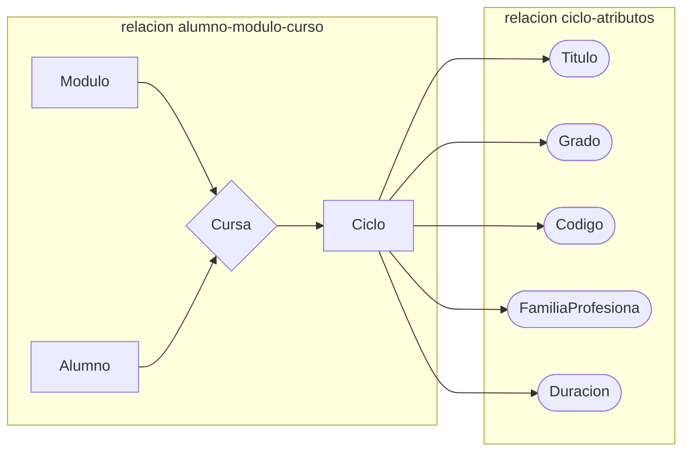

Vea [[BC2-Diseño de bases de datos relacionales.pdf]], vea [[BC1-Sistemas de almacenamiento de la información.pdf]], [[Bases_de_datos/BC1/Intro|Intro BC1]], [[Pasar de modelo EntidadRelación a modelo relación]], [[VerBasesDeDatos|MondongoDB]], [[CreateUsers|Crear usuarios en Oracle SQL usando SQL.]], [[Dar_Y_QUITAR_PERMISOS| dar y quitar permisos a usuarios usando SQL]].

Sintaxis:
1. [[DROP TABLE]]
2. [[Bases_de_datos/PL-SQL/Intro|Intro a PL/SQL]]
3. [[fetch]]
4. [[funciones_cadena]]

Ejercicios:
1. [[primeras-sentencias-sql(ciclista)]], [[todo-sql-ciclistas]], [[consultas]]
2. [[BC3_Ejercicios_6]]
3. [[provincias.sql]]
4. [[profesores-sql]]
5. [[Ejercicios_4]], [[script_insert]]
6. [[BC1_Ejercicios_1]]
7. [[BC1_Ejercicios_2]]
8. [[BC1_Ejercicios_3]]
9. [[BC3_Ejercicios_6]]
10. [[BC2_Ejercicios_3]]

- **Modelo conceptual**. 
	Se estudia el negocio, los datos que intervienen y las interrelaciones entre los mismos. Es la primera etapa del diseño donde se estudia el negocio, los datos involucrados y sus interrelaciones. Es una representación abstracta de la realidad que se quiere modelar.
-  **Modelo lógico**(``Modelo E/R`` o ``Diagrama E/R``). 
	a transformación del modelo conceptual en una estructura más formal. Aquí se crean las tablas o relaciones que representarán las entidades y sus relaciones.
- **Modelo físico**(Script + ajustes (índices, espacios, seguridad, etc)). 
	Es la implementación concreta del modelo lógico en un sistema de gestión de bases de datos específico. Incluye la creación de scripts SQL y ajustes como índices, espacios de almacenamiento y configuraciones de seguridad.
# Modelos de datos

### modelo entidad relación (Modelo E/R)
- Desarrollado por Peter Chen en 1976
- Modelo de datos muy utilizado para el diseño de bases de datos.
- Método de representación abstracta del mundo real que precede al modelo relacional.
- No es directamente aplicable a un SGBD. Se necesita una transformación a las estructuras de datos del modelo de datos propio del SGBD.
- 
#### Análisis de requisitos:
Para hacer un buen diseño, hay que entender bien que queremos hacer, comprender. Preguntar las necesidades, el orden de las cosas, estructurar los datos. Entender sobre que trabajamos

#### Diseño de normalización:
Cuando se normaliza el diseño. puede haber 5 normalizaciones.


![[Pasted image 20240925095007.png]] 
### Entidades 
Representan un objeto real o abstracto de interés en una organización y acerca del cual se quiere guardar una determinada información. Ejemplo: casa, cliente, empleado, etc. 
Según ``ANSI`` (1977) una entidad es una persona, lugar, cosa, concepto o suceso real o abstracto, de interés para la empresa. 
Hay dos tipos de entidades: ``fuertes`` y ``débiles``. 
Las ``entidades débiles`` se representan mediante un rectángulo doble. Son entidades cuya existencia depende de otra entidad.
Las entidades débiles dependen de otra entidad, _un movimiento es una entidad débil, pues depende de una cuenta bancaria_.

 - Representan objetos reales o abstractos de interés para una organización.
- Pueden ser fuertes (independientes) o débiles dependientes de otras entidades).
- Se representan gráficamente con rectángulos (dobles para entidades débiles).
- Las ocurrencias son instancias específicas de una entidad.

***Las entidades débiles se ponen en recuadros en mayúsculas y singular***
![[Pasted image 20240925095421.png]]

#### Ocurrencias de una entidad (Singular, una única entidad)
Es una instancia de una determinada entidad. Una unidad del conjunto que representa la entidad.
**Ocurrencia**: Es una instancia única de una entidad que representa un objeto o concepto del mundo real. Por ejemplo, si tienes una entidad llamada "Coche", cada coche específico que existe (como un Opel Insignia con matrícula 1234ABC) es una ocurrencia de la entidad "Coche".

Ejemplo: La entidad coche tiene varias instancias, una de ellas es el vehículo Opel Insignia con matrícula 1234ABC, de color negro y 5 puertas.

Una __entidad__ coche tiene varias **ocurrencias o instancias**, como el _motor_, el _color_, _matricula_, …
#### Atributos
Los tributos son únicas de entidades, las caracteriza. Un atributo es una propiedad o característica asociada a una entidad o relación. Para el caso de la entidad Alumno algunos ejemplos serían: nombre, apellidos, edad, dni, altura, peso, etc.

- Son propiedades o características de las entidades o relaciones.
    - Tipos:
        
        - Descriptores: atributos normales.
        - Identificadores: atributos que identifican unívocamente a una entidad (se subrayan).
        - Obligatorios vs Opcionales: según si deben tener un valor para todas las ocurrencias.
        - Uni-valuados vs Multivaluados: según si pueden tener múltiples valores.
        - Simples vs Derivados: según si su valor puede deducirse de otros atributos.

![[Pasted image 20240925095725.png]]
***Los atributos se escriben en minúsculas, dentro de una elipse***

En una base de datos, una entidad es un objeto o concepto del mundo real que se representa. Las entidades se definen por un conjunto de atributos, que describen sus características. Los atributos son las propiedades que describen las características de las entidades. Las relaciones indican cómo se relacionan las entidades entre sí.
- Los ``atributos descriptores``: son atributos normales.
- ***Un ``atributo identificador`` se subraya, en el ejemplo del coche, seria el numero de bastidor o la matricula.***

Todos los atributos que verifiquen la condición anterior serán ``atributos identificadores`` candidatos (uno de ellos será el ``atributo identificador`` principal, el resto serán atributos identificadores alternativos o secundarios). Puede haber varios atributos identificadores, pero solo uno puede ser el principal y a de ser único. El resto serán secundarios o alternativos
![[Pasted image 20240925100119.png]]

Por ejemplo si ALUMNO tuviera un atributo correo electrónico, no se puede tener como atributo identificador, pues un mismo alumno puede tener varios correos(atributo multivaluado). El atributo de una entidad a de ser único (normalmente).

##### Tipos de atributos según su opcionalidad 
Según si tienen o no, necesariamente un valor para todas las ocurrencias de una entidad. Las atributos han de ser mas pequeños que las entidades.
- Atributos Obligatorios 
- Atributos Opcionales 
``DNI``: Atributo obligatorio. Todo alumno debe tener uno. 
``tfno_fijo``: Atributo opcional. No es un campo relevante para un alumno.

##### Tipos de atributos según su cardinalidad 
Según si pueden tomar varios valores dentro del dominio para una ocurrencia de entidad. 
- Uni-valuados 
- Multivaluados 
``DNI``: Atributo Identificador principal: AIP 
``correo_e``: Atributo que puede tomar más de un valor para un alumno 9

##### Tipos de atributos según su carácter 
Según si su valor puede deducirse del valor de otros, por ejemplo, la edad a partir de la fecha de nacimiento. Se puede determinar calculándolo
- Atributos Simples 
- Atributos Derivados

##### Modelo entidad relación / modelo interrelación:
Las interrelación asocian una o mas entidades, son los "verbos".
Una relación (o interrelación), es una correspondencia o asociación entre dos o más entidades.
Cada relación tiene un nombre que describe su función. Normalmente debe utilizarse un nombre que exprese con totalidad la finalidad de la relación. 
Las relaciones se representan gráficamente mediante rombos y su nombre aparece en el interior. Generalmente el nombre corresponde a un verbo ya que describen acciones entre dos o más entidades. 
Las relaciones están clasificadas según su grado: número de entidades que participan en la relación.

- Relaciones (Interrelaciones):
    - Asocian dos o más entidades.
    - Se representan con rombos y generalmente se nombran con verbos.
    - Pueden tener sus propios atributos.
    - Se clasifican por su grado (número de entidades participantes).

***Se representan con un rombo y la primera en mayuscula***

Hay atributos para las relaciones:
![[Pasted image 20240925101011.png]]
El campo _fecha_, solo se dará cuando la relación "_reparar_" se de, este será la _fecha de relación_.

__Una relación de 3 entidades a de ser evitadas*__

El grado 3 es una **relación ternaria**. La entidad CICLO es un atributo de la relación cursa, pues el alumno puede **Cursa**r varios ciclos, es por esto que no puede ser atributo del ALUMNO, pues si lo fuera, ALUMNO, solo podría tener un CICLO asociado.

Ciclo define los siguientes atributos(atributos deben ser elipses, se representa mal en rectángulos):


M1 = mecánico 1
```c
M1 - fecha1 - Matricula1
M1 - fecha2 - Matricula2
M3 - fecha3 - Matricula1
```

Un mecánico puede arreglar varios vehículos, fecha se genera en la relación reparar.

- **``Cardinalidad``**: Número mínimo y máximo de ejemplares de una entidad implicados en una interrelación. (mínima, máxima)
	- Indica el número mínimo y máximo de ocurrencias de una entidad que pueden participar en una relación.
    - Se expresa como (mínima, máxima).
- **``Tipo de correspondencia``**: Número máximo de ejemplares de cada tipo de entidad implicados en una interrelación. ^5822c6

<h2>(mínima, máxima) (Cardinalidad)</h2> 

Un **ALUMNO**(_CESAR_) Pertenece (_a cuantos grupos, mínimo 1_) a un **GRUPO**:
![[Pasted image 20240925102513.png]] **Relación binaria**

***GRUPO pregunta la carnalidad de la izquierda (1,n) y alumno pregunta la carnalidad de la izquierda***

En un **GRUPO**(_el primero de DAM_) cuantos alumnos pertenece al **GRUPO** (_como mínimo 1 y como máximo N_):
![[Pasted image 20240925102628.png]] **Relación reflexiva**

Una entidad representa a varias entidades (_1, n_), pero sus subentidades son representados por un única entidad (_1, 1_).

- **Tipo de correspondencia**:
Numero máxima de ejemplares de cada tipo de entidad implicados en una interrelación.
Dentro de una ``CATEGORIA`` puede tener asociado ninguno(0) o varios ``PRODUCTO``(N), (0, N)
![[Pasted image 20240925103310.png]]
El tipo de correspondencia es `1:N`

![[Pasted image 20240925103437.png]]
- Categoría(``C1``) tiene asociado Producto 1 (``P1``) y Producto 2 (``P2``)
- Categoría(``C2``) No tiene asociado ninguna producto (``0, N``)
- Categoría(``C3``) tiene asociado Producto 3 (``P3``) 
- Categoría(``C4``) tiene asociado Producto 4 (``P4``) y Producto 5 (``P5``)

Aquí la [[#^5822c6|correspondencia]] son los valores máximos de cardinalidad de cada entidad. El máximo de Categoría es 1, y el máximo de producto es N, por lo tanto, la [[#^5822c6|correspondencia]] es (1, N).

Alumno no puede ser un atributo, pues un delegado también tiene numero de expediente, nombre y otros atributo, y un atributo, no puede tener atributos.
![[Pasted image 20241002102658.png]]