```diff
+ a -- a --> a
- b -- b --> s
```

${\color{red}Letras color rojo}$


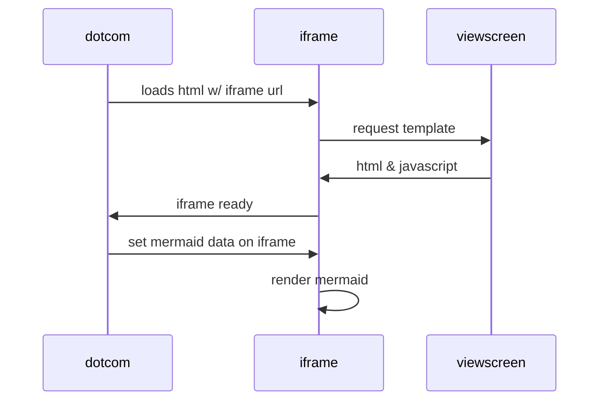

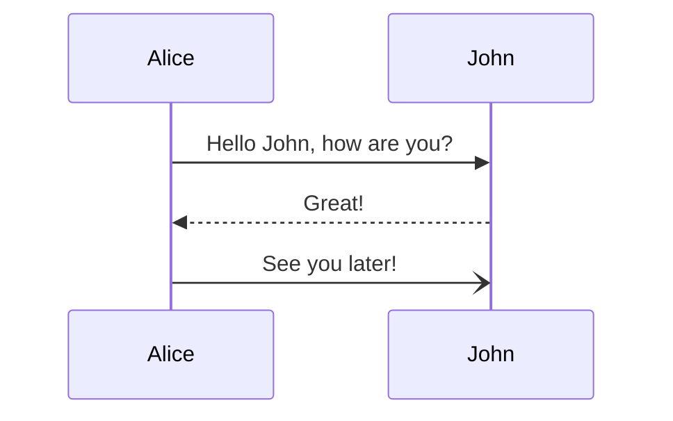

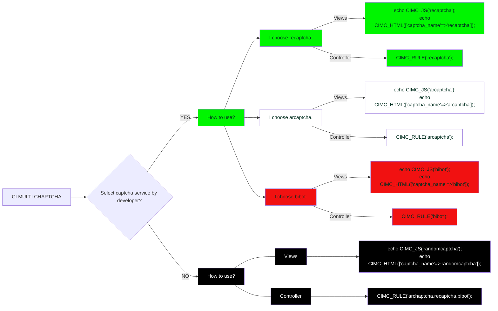

When $a \ne 0$, there are two solutions to $(ax^2 + bx + c = 0)$ and they are .

$$ x = {-b \pm \sqrt{b^2-4ac} \over 2a} $$

**The Cauchy-Schwarz Inequality**

$$\alpha, \Alpha, \beta, \Beta, \gamma, \Gamma, \pi, \Pi, \phi, \varphi, \mu, \Phi \cos (2\theta) = \cos^2 \theta - \sin^2 \theta, Esto, usa, latex$$

$$\left( \sum_{k=1}^n a_k b_k \right)^2 \leq \left( \sum_{k=1}^n a_k^2 \right) \left( \sum_{k=1}^n b_k^2 \right) x \equiv a \pmod{b}$$

$$\frac{n!}{k!(n-k)!} = \binom{n}{k}$$

$$\begin{equation} x = a_0 + 
\cfrac{1}{a_1 + 
\cfrac{1}{a_2  + 
\cfrac{1}{a_3 + 
\cfrac{1}{a_4} } } }
\end{equation}$$

$$\sqrt[n]{1+x+x^2+x^3+\dots+x^n}$$


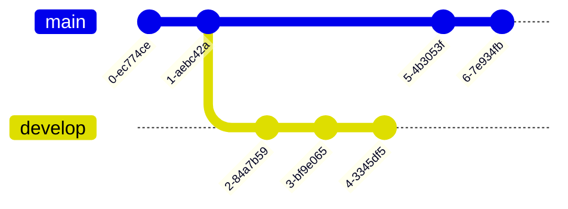
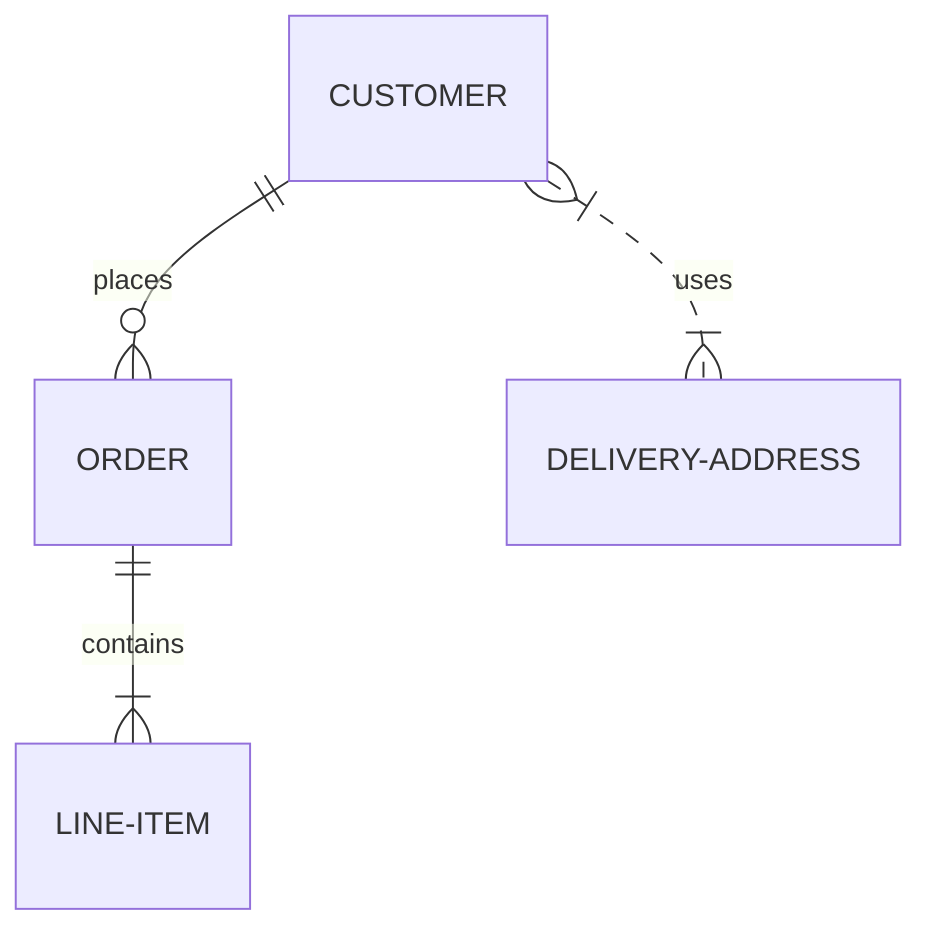

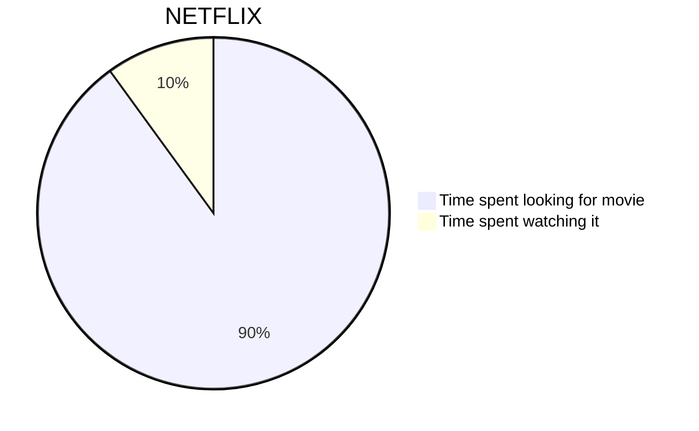
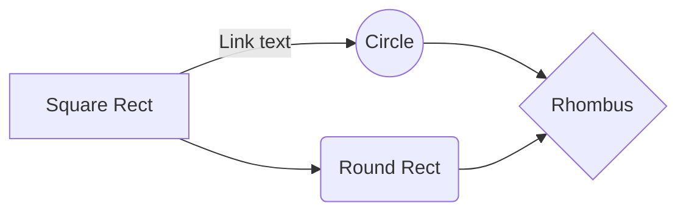

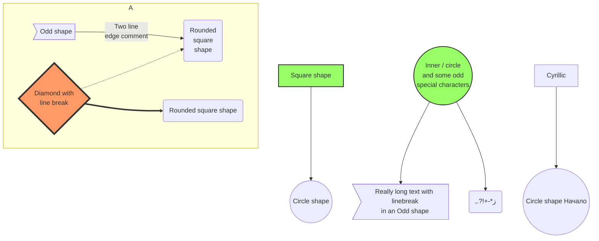
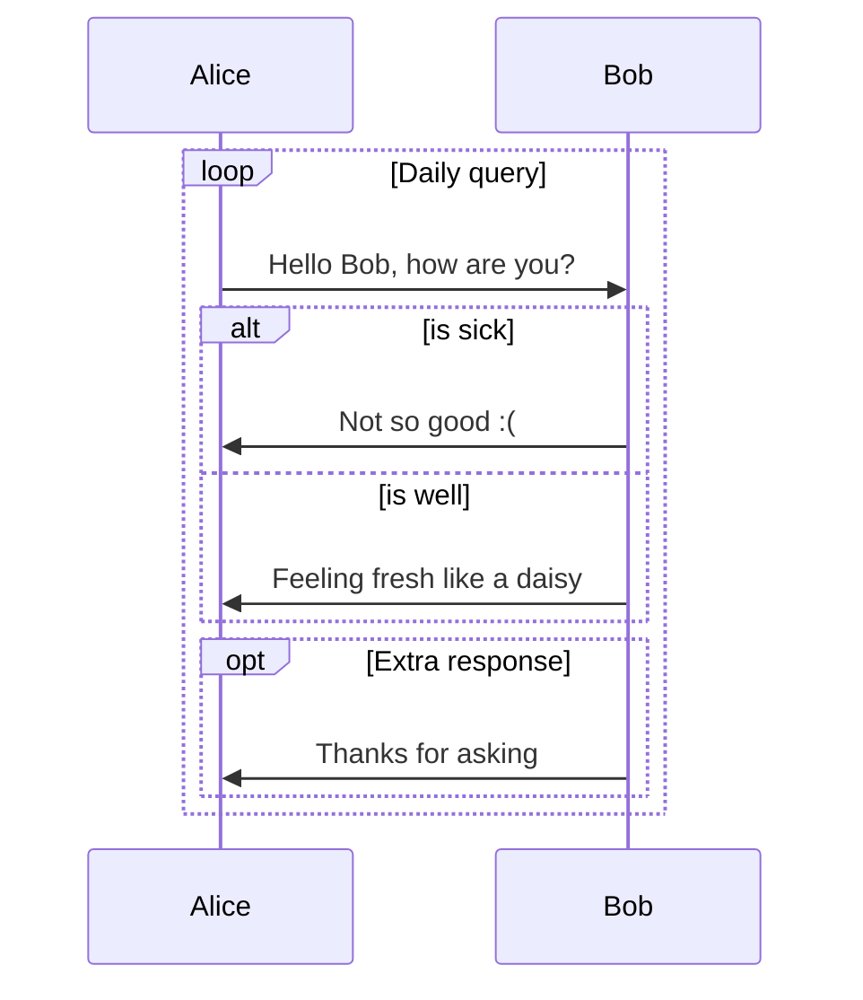

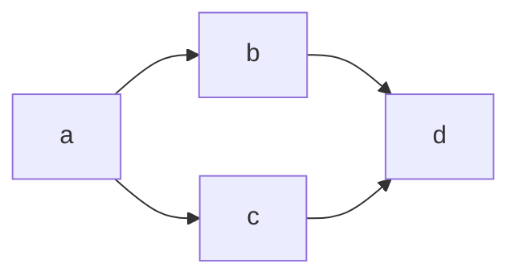

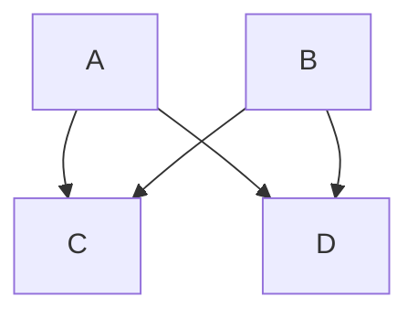

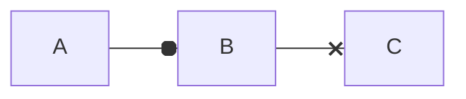
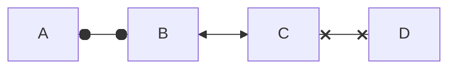
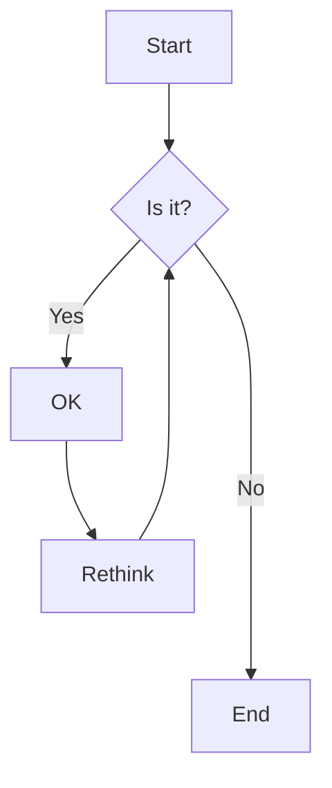


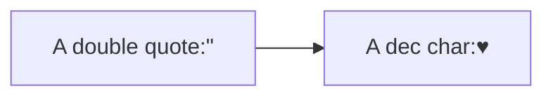
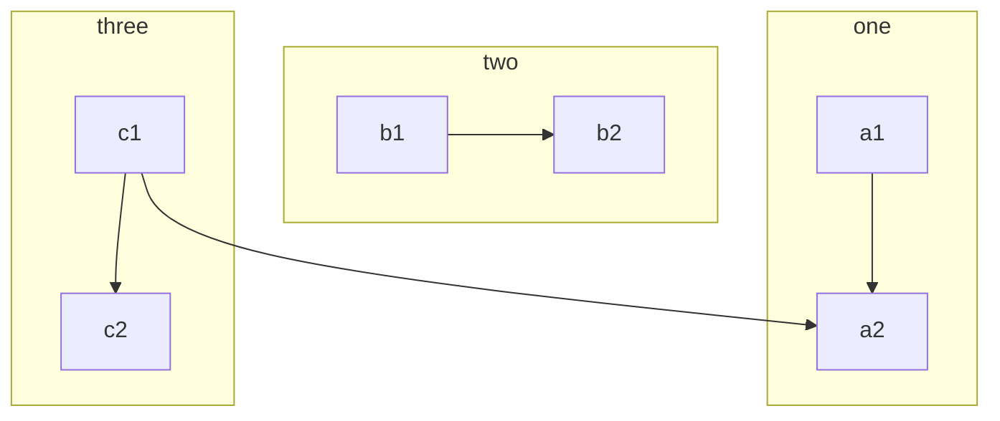
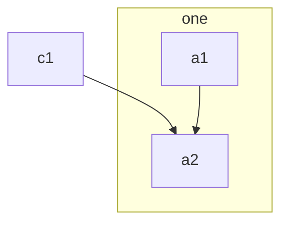
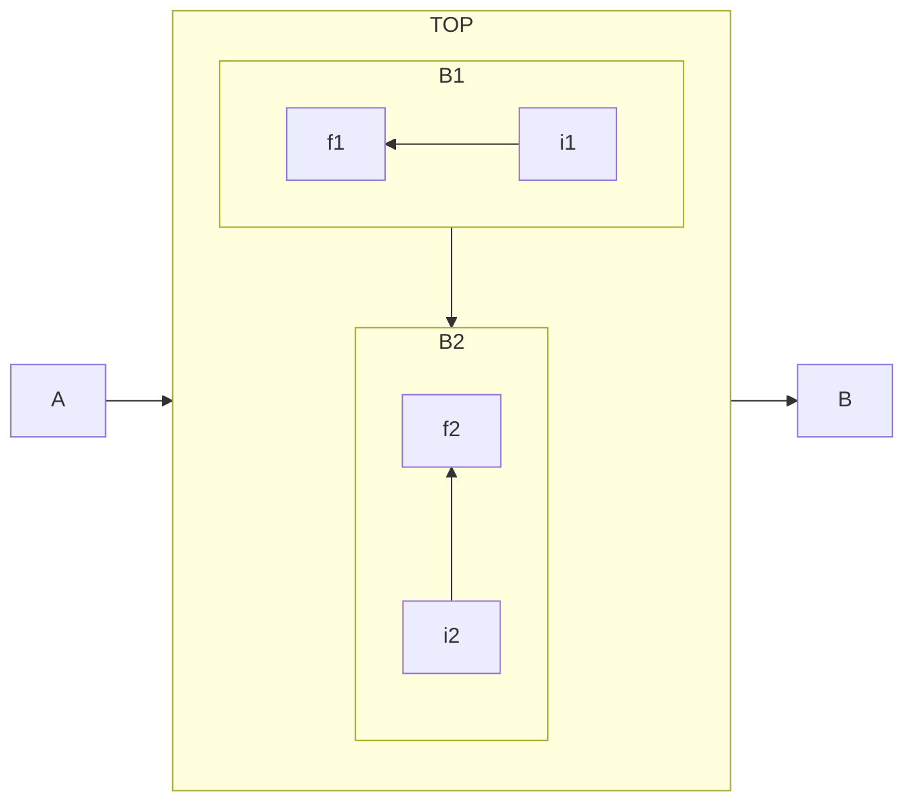
```mermaid 
flowchart LR
    id1(Start)-->id2(Stop)
    style id1 fill:#f9f,stroke:#333,stroke-width:4px
    style id2 fill:#bbf,stroke:#f66,stroke-width:2px,color:#fff,stroke-dasharray: 5 5

```
```mermaid 
flowchart TD
    B["fab:fa-twitter for peace"]
    B-->C[fa:fa-ban forbidden]
    B-->D(fa:fa-spinner);
    B-->E(A fa:fa-camera-retro perhaps?)
```
```mermaid 
flowchart LR
   A-. text .-> B
```
```mermaid 
flowchart TD
    id1(((This is the text in the circle)))
```
```mermaid 
flowchart TD
    B[\Go shopping/]
```
```mermaid 
flowchart TD
    A[/Christmas\]
```
```mermaid 
flowchart TD
    id1[\This is the text in the box\]
```

```mermaid 
flowchart TD
    id1[/This is the text in the box/]
```
```mermaid 
flowchart LR
    id1{{This is the text in the box}}
```
```mermaid 
flowchart LR
    id1{{This is the text in the box}}
```

```mermaid 
flowchart LR
    id1>This is the text in the box]
```
```mermaid 
flowchart LR
    id1((This is the text in the circle))
```
```mermaid 
flowchart LR
    id1[(Database)]
```
```mermaid 
flowchart LR
    id1[[This is the text in the box]]
```
```mermaid 
flowchart LR
    id1([This is the text in the box])
```
```mermaid 
flowchart LR
    id1(This is the text in the box)
```

TB - top to bottom
TD - top-down/ same as top to bottom
BT - bottom to top
RL - right to left
LR - left to right

```mermaid 
flowchart LR
    Start --> Stop
```
```mermaid 
flowchart TD
    Start --> Stop
```


```mermaid 
flowchart TB
    A & B--> C & D
```

<details>
<summary>Menu desplegable </summary>
<pre>
488 cd /opt/LLL/controller/laser/
489 vi LLLSDLaserControl.c
490 make 
491 make install
492 ./sanity_check
493 ./configure -o test.cfg
494 vi test.cfg
495 vi ~/last_will_and_testament.txt
496 cat /proc/meminfo
497 ps -a -x -u
498 kill -9 2207
499 kill 2208
500 ps -a -x -u
501 touch /opt/LLL/run/ok
502 LLLSDLaserControl -ok1
</pre>
</details>