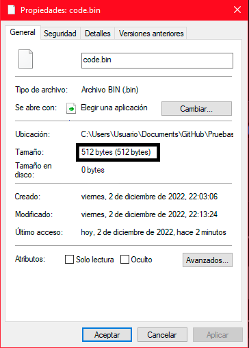
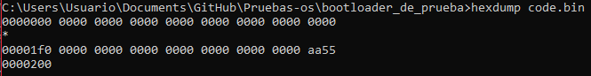
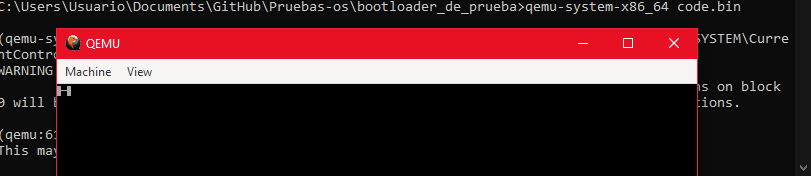
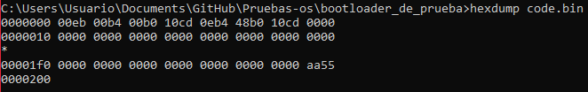
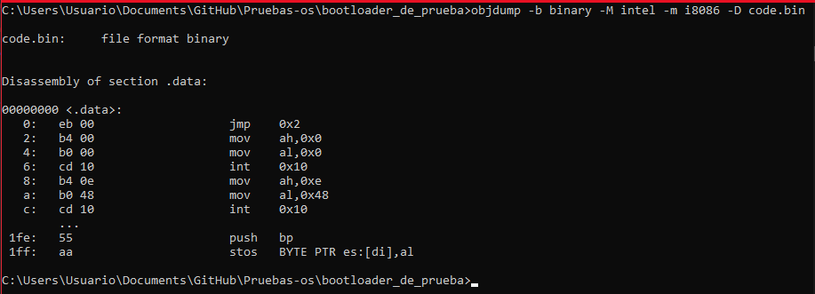

# Creando nuestro primer bootloader
----
Empezar diciendo que es un bootloader. También conocidos como cargadores de arranque, es el de los primeros programas en ser ejecutados por nuestro PC al encenderle.
Un cargador tiene varias funciones a realizar, activar la [[linea A20]] o cargar nuestro kernel es una de esas tareas.
El cargador de arranque se a de encontrar en el primer sector de nuestro disco, y a de estar formado por `512 Bytes`. Además a de cargarse en memoria en unas direcciones especificas, a de estar entre la dirección de inicio `0x7c00` y la dirección `0x7e00`. Cabe mencionar que son direcciones de memoria de 16bits ya que estamos en modo real, esto es debido a que nuestro PC, por defecto inicia en el modo de direccionamiento real, y es el bootloader el encargado de activar el modo protegido, extendido o el que se requiera.
En esta foto podemos ver la estructura de memoria de lo que ocurre en nuestro PC:
- Podemos situar el vector de la tabla de interrupciones entre las direcciones `0x0000 - 0x0400`.
- Situamos un área de datos para el BIOS entre las direcciones `0x0400 - 0x0500`.
- Encontramos un arreas libres de uso entre las direcciones `0x0500 - 0x7c00`, `0x00007e00 - 0x0009fc00` y a partir de la dirección `0x00100000` para adelante.
- Encontramos el [[MBR]] (Master Boot Record) o sector de arranque, o arranque maestro, como mas gustes llamarlo, entre las direcciones de memorias `0x7c00 - 0x7e00`.
- Entre las direcciones de memoria `0x0009fc00 - 0x000A0000` Encontramos una sesión de datos extendida para el BIOS.
- Entre las direcciones `0x000A0000 - 0x000C0000`, encontramos la memoria de video.
- Por ultimo encontramos entre las direcciones `0x000C0000 - 0x00100000` un área de datos donde se aloja el programa [[BIOS]] cargado en memoria.
- Todo lo posterior a la sesión `0x00100000` esta fuera de libre uso para la creación de nuestro OS (Operative System).


----
## Sector de arranque (MBR):
El sector de arranque es en teoría el primer sector (sector 0), de un dispositivo de almacenamiento. Técnicamente el [[MBR]] y el sector de arranque no son lo mismo, pero por simplicidad los trataremos como sinónimos. El sector de arranque es donde alojaremos nuestro código del cargador de arranque, aunque no solo se suele usar para alojar el código del bootloader.

|      Bytes      |                                                               Descripcion                                                                |
| :-------------: | :--------------------------------------------------------------------------------------------------------------------------------------: |
| **`446 Bytes`** | Codigo maquina, se puede usar los ultimos `6 Bytes` para meter `4 Bytes` de firma de disco y 2 bytes adicionales que suele ser `0x0000`. |
| **`64 Bytes`**  | Se usan para definir la tabla de partciones (se tiene 4 registros de `16 Bytes` donde se define cada una de las particiones primarias).  |
|  **`2 Bytes`**  |                                                    Firma de [[MBR]] que son `0x55aa`.                                                    |

Aquí describimos el uso de cada offset de los registros que definen las particiones primarias

| offset     | Descripcion                                                                             |
| ---------- | --------------------------------------------------------------------------------------- |
| **`0x00`** | Estado                                                                                  |
| **`0x01`** | Cilindro-Cabezal-Sector(CHS = Cylinder-Head-Sector) del primer sector de la partcicion. |
| **`0x04`** | Tipo de particion                                                                       |
| **`0x05`** | Cilindro-Cabezal-Sector(CHS = Cylinder-Head-Sector) del ultimo sector de la partcicion. |
| **`0x08`** | (4 Bytes) Logic loc Address(LBA) del primer  sector de la particion.                    |
| **`0x0c`** | (4 Bytes) Longitud de la particion en sectores .                                        |

Aquí el valor que se a de colocar en el offset ``0x04`` de nuestros registros para definir el tipo de partición.

|   valor    |                          tipo                          |
| :--------: | :----------------------------------------------------: |
| **`0x00`** |                     Empty = Vacio.                     |
| **`0x01`** |                DOS 12-bit Fat = FAT12.                 |
| **`0x02`** |                      XENIX root.                       |
| **`0x03`** |                      XENIX /usr.                       |
| **`0x04`** |       DOS 3.0+ 16-bits FAT (up to 32M) = FAT16.        |
| **`0x05`** | DOS 3.3+ Extended Partition = particion extendida DOS. |
| **`0x06`** |      DOS 3.31+ 16-bits FAT (over to 32M) = FAT16.      |
| **`0x07`** |                       OS/2 IFS.                        |
| **`0x07`** |                    Windows NT NTFS.                    |
| **`0x07`** |                         ExFat.                         |
| **`0x07`** |                     Advanced Unix.                     |
| **`0x07`** |                    QNX2.x pre-1988.                    |
| **`0x08`** |                 OS/2 (v1.0-1.3 only).                  |
| **`0x08`** |                  AIX boot partition.                   |
| **`0x08`** |                      SplitDrive.                       |
| **`0x08`** |                     Commodore DOS.                     |
| **`0x08`** |        DELL partition spanning multiple drives.        |
| **`0x08`** |                 QNX 1.x and 2.x (qny).                 |
| **`0x09`** |                  AIX data paratition.                  |
| **`0x09`** |                 QNX 1.x and 2.x (qnz).                 |
| **`0x0a`** |                   OS/2 Boot Manager                    |
| **`0x0a`** |                Coherent swap partition                 |
| **`0x0a`** |                          Opus                          |
| **`0x0b`** |                   WIN95 OSR2 FAT32.                    |
| **`0x0c`** |             WIN95 OSR2 FAT32, LBA-mapped.              |
| **`0x0d`** |                     Silicon safe.                      |
| **`0x0e`** |           WIN95 DOS 16-bit FAT, LBA-mapped.            |
| **`0x0f`** |         WIN95: Extended partition, LBA-mapped.         |
| **`0x10`** |                       OPUS (?).                        |
| **`0x0e`** |                 Hidden DOS 12-bit FAT                  |
| **`...`**  |                          ...                           |

----
## Requisitos mínimos para programar nuestro bootloader simple: 

- Necesitamos mínimo saber `Assembly x86` (`asm`), en especifico estaremos usando sintaxis `intel` y escribiendo código de `16 bits` principalmente.
- En cuanto al software que necesitaremos mínimo será lo siguiente: 

    1. __`nasm`__. Lo usaremos para generar binario planos mediante código ensamblador
    2. __`binutools`__ ([[gcc/g++]], [[hexdump_uso_basico|hexdump]], as, [[objdump]]...). Principalmente estaremos aquí usado [[hexdump_uso_basico|hexdump]] y [[objdump]] para estudiar nuestro código compilado. Aunque si tenéis algún desensamblador que os guste mas podéis usarlo siempre que lo uséis de la forma correcta, recordar que es código x86 de 16bits, vuestro desensamblador no a de leer el código en 64bits o 32bits sino en 16bits.
    3. __`qemu-system-x86_64`__. Lo usaremos para ejecutar nuestro bootloader usando virtualización.

- En cuanto a nivel de hardware, __no necesitamos nada especial__, algo con lo que puedas instalar todas estas herramientas es suficiente. da igual si es Linux o Windows, al final no influye en nuestro desarrollo mientras nos permita trabajar de forma cómoda. Pongamos de ejemplo lo mas básico, una PC con un Ubuntu de 32bits o un Windows 10 live de 32bits, con un procesador Intel basico y 60Gb de ROM, aunque al final da igual. Como estamos haciendo un bootloader virtualizado, lo primero es que no vamos a ser capaz de aprovechar todos los recursos ya que como mucho estaremos leyendo y escribiendo en pantalla y en el disco 4 cosas. La arquitectura real del pc da igual, como lo estamos ejecutando sobre una `VM (Virtual Maching = Maquina Virtual) x86 ` al final se estará emulando una maquina para la que el bootloader esta destinado.
----
## Empezamos con lo basico:

Lo primero que haremos será coger un editor de código que nos facilite la escritura del mismo, y crearemos un archivo que se llame por ejemplo "`boot.asm`", en este archivo estaremos escribiendo el código de nuestro cargador como tal.

Una vez creado nuestro archivo primero debemos usar la directiva:
```c
[bits 16]
```
No es necesario poner los corchetes, pero a mi me gusta mas así. Esto no es una instrucción en ensamblador, sino una directiva de `nasm` con la que le especificaremos, que desde que se situó esta directiva hasta la próxima directiva de tipo `bits`, el código será de tipo `16 bits`. 
A continuación debemos escribir dos directivas mas importantes para nuestra tarea, estas son las siguientes:
```c
times 510 -( $ - $$ ) db 0 
dw 0xaa55
```
Este fragmento de código ira al final de nuestro bootloader, lo que hace es sencillo. La primer directiva `times 510 -( $ - $$ ) db 0` Calcula la cantidad de números `0` de relleno que tendrá que añadir para que nuestro bootloader llegue a `510 bytes`, si nuestro código ocupa `12 bytes`, esta directiva hara la siguiente operación `510 - 12 = 498 bytes` que serán rellenos de 0. 
A continuación, nuestra directiva `dw 0xaa55` escribe un `word` lo cual son `2 bytes`, `0xaa55 = 0xaa 0x55` esto lo escribe al final del archivo para firmar nuestro [[MBR]], se podría decir que es nuestra "palabra mágica" y sin ella las cosas no funcionaran como deben. Una vez explicada cada directiva, debemos darnos cuenta que la primera directiva rellena nuestro binario con valores nulos hasta alcanzar los `510 bytes` y que con la siguiente directiva escribimos otros `2 bytes`.
Por lo que en total tenemos 
`510 + 2 = 512 bytes` 
de binario, esto es importante ya que nuestro bootloader solo puede tener como tal `512 bytes` ya que nuestro sector de arranque empieza en `0x7c00 = 31744` y acaba en `0x7e00 = 32256`. Con una simple cuenta apreciaremos de que solo se dispone de :
`32256 - 31744 = 0x7e00 - 0x7c00 = 512 bytes` 

para el espacio para nuestro sector de arranque. Aun así, hay técnicas para aumentar el tamaño de nuestro código, aunque un buen bootloader tampoco necesita recurrir estas técnicas.
Podemos compilador nuestro código `asm` con el siguiente comando:
```c
nasm -f bin boot.asm -o code.bin
```
Aquí le decimas a nasm que el formato de nuestro binario es de tipo __"binario plano__" mediante el `-f bin`, a continuación especificamos el archivo que contiene nuestro código asm (`boot.asm`) y con la flag `-o` decimos que el nombre del archivo de salida es `code.bin`. Esto nos genera una archivo binario de `512 bytes`



Ahora vamos a ver el código hexadecimal que se a generado haciendo uso en mi caso de `hexdump`:
```c
 hexdump code.bin
```



Como podemos observar, todo el codigo son valores nulos (`0x00 0x00 = 0x0000`) excepto los 2 ultimos bytes del binario que son `0xaa55` como especificamos nosotros. Tmb podemos observas que nos han puesto un hasterisco de por medias el cual indica que nos han acortado el resultado debido a que en esas direciones de memoria se siguen teniendo los mismo valores, los cuales son nulos. Podemos especificar que se nos muestre toda la salida completa con el argumento `-v` en [[hexdump_uso_basico|hexdump]]. 
Cabe mencionar, que la columna de la izquierda indica la dirección de memoria, y las demás son los datos(el código de nuestro binario en hexadecimal), en la posición `0x0000` de nuestro binario tenemos el valor `0x0`, lo mismo en la posición `0x0001` y así hasta la posición `0x1fe`, que tiene el valor `0xaa` y la posición `0x1ff` que tiene el valor `0x55`. Estas direcciones de memoria se pueden calcular con la columna de la izquierda. Por cada fila, se muestran una cantidad de `16 bytes`, estos van desde `0x0 a 0xf` o lo que es lo mismo en decimal, de `0 a 15`. Para calcular nuestra dirección de memoria en la que se encuentra el byte `0xaa`, situamos la fila mediante la columna de direcciones de memoria, nuestra fila en este caso es la `0x01f0`, a continuación buscamos la columna donde se sitúa nuestro byte, en esta caso, el byte esta en la columna `0xe` así que `0x01f0 + 0xe = 0x01fe`, nuestro carácter esta en `0x01fe`.

|`addres` | `0`| `1`| `2`| `3`| `4`| `5`| `6`| `7`| `8`| `9`| `a`| `b`| `d` |`d`| `e`| `f`|
|:-------:|:--:|:--:|:--:|:--:|:--:|:--:|:--:|:--:|:--:|:--:|:--:|:--:|:--:|:--:|:--:|:--:|
|`0000000`|`00`|`00`|`00`|`00`|`00`|`00`|`00`|`00`|`00`|`00`|`00`|`00`|`00`|`00`|`00`|`00`|
|    *    |....|....|....|....|....|....|....|....|....|....|....|....|....|....|....|....|
|`00001f0`|`00`|`00`|`00`|`00`|`00`|`00`|`00`|`00`|`00`|`00`|`00`|`00`|`00`|`00`|`aa`|`55`|
|`0000200`|   F|   I|   N|:)  |D   |   E|   L|:(  |   A|   R|   C|   H|   I|   V|   O|   .|

----  

Ahora vamos a intentar mostrar algo por pantalla, para ello haremos uso de la interrupción `10h = 0x10` del BIOS. Para esto se usa registro para especiar el servicio a usar y su configuración. Nosotros usaremos los servicios de video para imprimir información y especiar la resolución mediante el modo de video. Para especificar el modo de video, debemos darle al registro `ah` el valor `0x00`, esto podemos hacerlo con un `mov ah, 0` o con un `xor ah, ah`. En el registro `al`, especificaremos el modo de video que queremos usar, por ejemplo, si ponemos en al el valor ``0x00`` `mov al, 0x00`, tendremos una resolución de 40x25 con colores en Blanco y Negro (Monocromático). Cabe mencionar, que para aplicar los cambios, debemos llamar a la interrupción `10h` mediante un [[int 0x10]] para efectuar la operación. A continuación los distintos modos de video disponibles:

|Valor Para AL|Resolucion|Modos que permite|
|:---:|:---:|:---:|
|`0x00` |    40x25    |   B/W texto (CGA,EGA,MCGA,VGA)
| `0x01` |    40x25    |   16 texto a color (CGA,EGA,MCGA,VGA)
| `0x02` |    80x25    |   16 texto en tonos de gris (CGA,EGA,MCGA,VGA)
| `0x03` |    80x25    |   16 texto a color (CGA,EGA,MCGA,VGA)
| `0x04` |    320x200  |   4 gráficos a color (CGA,EGA,MCGA,VGA)
| `0x05` |    320x200  |   4 gráficos a color (CGA,EGA,MCGA,VGA)
| `0x06` |    640x200  |   Gráficos en B/N (CGA,EGA,MCGA,VGA)
| `0x07` |    80x25    |   Texto monocromático (MDA,HERC,EGA,VGA)
| `0x08` |    160x200  |   Gráficos de 16 colores (PCjr)
| `0x09` |    320x200  |   Gráficos de 16 colores (PCjr)
| `0x0A` |    640x200  |   Gráficos de 4 colores (PCjr)
| `0x0B` |    Reservado|   (EGA BIOS función 11)
| `0x0C` |    Reservado|   (EGA BIOS función 11)
| `0x0D` |    320x200  |   Gráficos de 16 colores (EGA,VGA)
| `0x0E` |    640x200  |   Gráficos de 16 colores (EGA,VGA)
| `0x0F` |    640x350  |   Gráficos monocromáticos (EGA,VGA)
| `0x10` |    640x350  |   Gráficos de 16 colores (EGA or VGA with 128K) o de 4 colores (64K EGA)
| `0x11` |    640x480  |   Gráficos B/N (MCGA,VGA)
| `0x12` |    640x480  |   Gráficos de 16 colores (VGA)
| `0x13` |    320x200  |   Gráficos de 256 colores (MCGA,VGA) 

Nosotros por ahora con usar el primer modo de video, de ``40x25`` con texto en B/H, nos es suficiente. Para ello usaremos el siguiente fragmento de código.

```c
mov ah, 0x00  ; Servicio de modo video
mov al, 0x00  ; Modo de video 0x00
int 0x10      ; Interupcion 10H al BIOS
```
----
Aunque con esto no hemos escrito aun nada, veamos como hacer esto. Para escribir texto en modo teletipo, tenemos el servicio de `escribir texto en Modo teletipo`. Este servicio es el `0x0e`. En el registro `al` se recibe un carácter `ASCII`, en el registro `bh` el numero de pagina y en el `bl` el color(para modos gráficos).
```ruby
- el cursor avanza después de escribir
- los caracteres BEL (7), BS (8), LF (A) y CR (D) son
tratados como códigos de control
- para algunas BIOS más antiguas (19/10/81), el registro BH debe
apuntar a la página mostrada actualmente
- en los adaptadores CGA esta función puede deshabilitar la señal de video mientras se realiza la
salida que causa flitter.
```
Por lo que nuestro código quedaría así, si queremos escribir un carácter `'H'` por ejemplo:
```c
mov ah, 0x0e  ; Servicio de texto en Modo teletipo
mov al, 'H'   ; Mover el valor del caracter 'H' al registro al
int 0x10      ; Interrupcion al BIOS mediante 10h
```
----
Ahora hay que preguntarse, todo este código que hemos estado, donde podemos ponerlo. Este código es recomendable escribirlo a partir de una etiqueta, podéis llamarla como queráis, en mi caso la llamare `start` y es donde empezara el código de mi bootloader. 
Debemos poner a partir de la directiva `[bits 16]` un `jmp` a nuestra etiqueta por cuestiones de seguridad, ya que si introducimos datos antes del código, y la maquina los lee, los tratara como instrucciones, y como no  queremos que un Sting sea ejecutada como instrucciones, indicamos que antes de llegar a esta sección de datos si es que existe, salta a nuestra etiqueta donde se aloja el código que si queremos ejecutar. 
Como tal no tenemos sesiones, como en un programa convencional, no tenemos un `.data`, `.bss` o `.text`, es por eso que para nuestro ordenador, un Sting, una dirección de memoria, o una instrucción, serán ejecutas sin distinción. Resumiendo todo, con el `jmp` saltamos  directamente a nuestro código nada mas el PC empiece a ejecutar nuestro código, de esta manera, podemos escribir los datos que necesitemos entre `jmp start` y la etiqueta `start`.
Otra cosa importante es hacer un `jmp $`, para el que no sepa que es esto, es hacer un salta a la misma dirección donde se encuentre esta instrucción, haciéndose un bucle infinito. ¿Por que queremos esto? La respuesta es sencilla, una vez finalice el código de nuestro bootloader, si el PC no encuentra "nada mas que hacer" finalizara el programa y no queremos eso, para solucionarlo, hacemos un salto a si mismo, entrando en este bucle infinito que deja corriendo nuestro código hasta que se apague la maquina.

Por ahora, tenemos esto de código en nuestro archivo `boot.asm`:
```c
[bits 16]         ; Se quiere escribir codigo de 16 bits
jmp start         ; Saltamos directamente a la etiqueta
                  ; que contiene el codigo de nuestro
                  ; bootloader.


start:
    mov ah, 0x00  ; Servicio de modo video
    mov al, 0x00  ; Modo de video 0x00
    int 0x10      ; Interupcion 10H al BIOS

    mov ah, 0x0e  ; Servicio de texto en Modo teletipo
    mov al, 'H'   ; Mover el valor del caracter 'H' al registro al
    int 0x10      ; Interrupcion al BIOS mediante 10h

    jmp $


times 510 -( $ - $$ ) db 0 ; Rellenar con valores nulos
                           ; hasta que se alcance 510 bytes
dw 0xaa55                  ; escribir al final del binario 
                           ; los bytes 0xaa y 0x55 para
                           ; firmar el MBR
```
Si compilamos con un:
```c
nasm -f bin boot.asm -o code.bin
```
Y ejecutamos con qemu:
```c
qemu-system-x86_64 code.bin
```
Podemos ver como se nos a impreso el caracter 'H' en nuestra maquina virtual:


Ahora vamos a estudiar el codigo de nuestro bootloader con hexdump y objdump(aunque estudiar el codigo con objdump no es muy fiable si empieza a haber datos, ya que interpretara los datos como instruciones de codigo):
```c
hexdump code.bin
```




|`addres` | `0`| `1`| `2`| `3`| `4`| `5`| `6`| `7`| `8`| `9`| `a`| `b`| `d` |`d`| `e`| `f`|
|:-------:|:--:|:--:|:--:|:--:|:--:|:--:|:--:|:--:|:--:|:--:|:--:|:--:|:--:|:--:|:--:|:--:|
|`0000000`|`00`|`eb`|`00`|`b4`|`00`|`b8`|`10`|`cd`|`0e`|`b4`|`48`|`b8`|`10`|`cd`|`00`|`00`|
|`0000010`|`00`|`00`|`00`|`00`|`00`|`00`|`00`|`00`|`00`|`00`|`00`|`00`|`00`|`00`|`00`|`00`|
|    *    |....|....|....|....|....|....|....|....|....|....|....|....|....|....|....|....|
|`00001f0`|`00`|`00`|`00`|`00`|`00`|`00`|`00`|`00`|`00`|`00`|`00`|`00`|`00`|`00`|`aa`|`55`|
|`0000200`|   F|   I|   N|:)  |D   |   E|   L|:(  |   A|   R|   C|   H|   I|   V|   O|   .|

Y el comando [[objdump]] para obtener los opcodes de las instrucciones:
```c
objdump -b binary -M intel -m i8086 -D code.bin
```
con el parámetro `-b` especificamos el formato del archivo, que es `binary = binario`, con `-M intel` especificamos que la salida nos la de en [[sintaxis intel]] y no [[sintaxis T&AT]] que es la que muestra por defecto. `-m i8086` que es la arquitectura, i[[8086]] es lo mismo que x86. `-D` para decir que desensamble todas las sesiones del programa, y por ultimo especificamos el archivo binario a desensamblar, en mi caso `code.bin`.




| Adress | opcode | instrucion |
|:------:|:------:|:-----------|
|  0:    | eb 00  |jmp    0x2  |
|  2:    | b4 00  |mov    ah,0x0   |
|  4:    | b0 00  |mov    al,0x0   |
|  6:    | cd 10  |int    0x10     |
|  8:    | b4 0e  |mov    ah,0xe   |
|  a:    | b0 48  |mov    al,0x48  |
|  c:    | cd 10  |int    0x10     |
|        | ...    |                            |
|1fe:    | 55     |push   bp                   |
|1ff:    | aa     |stos   BYTE PTR es:[di],al  |

Aquí podemos ver la correspondencia de cada instrucción `asm` a código hexadecimal (opcode). Aun así, esto no es fiable del todo si no sabemos donde se encuentra nuestro datos y donde se encuentra nuestro código. Por ejemplo, podemos ver que el `word` `0xaa55` nos lo a interpretado como la instrucción `push bp` y la instrucción `stos BYTE PTR es:[di], al`. Por lo que tenga cuidado con lo que lee. 
Quitando estos dos opcodes, los demás son correctos. A veces necesitaremos saber el opcode de una instrucción especifica, esto lo podemos sacas de varias maneras `Metasploit` tiene un script para esta tarea, yo programe una pieza de cogido que intenta recrear este para realizar la tarea, se llama [get_opcode.c](../get_opcode.md).
